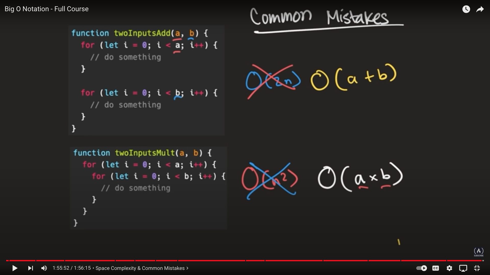

# BIG-O NOTATION AND ALGORITHMS ANALYSIS

## Big-O notation explanation

Big O notation is used to analyze the efficiency of an algorithm as its input approaches inifinity, which means that as the size of the input grows, how drastically do the space or time requirements grow with it.
For example lets say that we have a dentist and she takes 30 minutes to treat one patient.As her line of patients increases , the time that it takes for her to treat all of the patients will scale linearly with the number of patients waiting in line.
This is because it always takes her a constant amount of time to treat each individual patient which is 30 minutes. This gives us a general understanding of how long our dentist would take to treat 10 patients, 20 patients or even 100,000 patients. This is beacuse since we know that the dentist takes a contant amount of time, which is 30 minutes to treat each patient, we can always calculate the amount of time it would take for her to treat any number of patients by multiplying the number of patients times 30 minutes.
With this in mind, we can categorize her efficiency as being linear O(n). where n is the number of patients.
The amount of work it takes for her to finish her work scales linearly or proportionally with the number of patients., We use the same technique to determine the efficiency of algorithms.
We can get a general idea of how functions time efficiency scales by categorizing a given functions efficiency the same way that we categorize the dentist efficiency

## ORDER OF GROWTH HIERARCHY

    O(1) => constant time
                |
    O(log n) => logarithmic time
                |
    O(n)=> linear time
                |
    O(n log n)=> linearithmic time
                |
    O(n ^ 2) => Quadratic time
                |
    O(n ^ 3) => cubic time
                |
    O(2 ^ n) => exponential
                |
    O(n!) => factorial

## N/B

when i enconter  a loop where 2 is subtracted from n everytime the loop runs the runtime is:
O(n/2) => O(n * 1/2) => O(n)
So subtrating 3 is:
O(n/3) => O(n * 1/3) => O(n)

But when we encounter an algorithim where n is continuously divided by 2. thats a log 2
Therefore when n is countinouously divided by 3 , thats a log 3

## LOGARITHMS

A logarithm is the power that a number needs to be raised to to get some other number
In computer science unless specified otherwise, we can always assume that the number
that we want to raise to some power is 2, meaning that the base is always 2 unless specified otherwise.
log2 8 = 3
What is the number that we can raise 2 to to get 8 or 2 ? = 8.
the answer is 3.
Therefore Log base 2 of 8 is 3

## MERGE SORT TIME COMPLEXITY

arr = [6, 1, 23, 3]
To understand the time complexity of mergesort we'll take an array of length 4 into consideration. We will pass this array to the mergesort function.
And what that call to the merge sort will do is divide the array approximately in half and those halves will be passed to merge sort recursively.
And after the arrays are done dividing , we will have arrays of length one meaning that we cant split the arrays any further. And to understand the time complexity of merge sort, we need to understand O(log n). So as we know, in computer science, O(log n) is the same as log2 n. where n is the length of our array which in our case is 4.

Therefore:
log2 4 = 2 because 22 = 4

which means that for array of length 4, there will be two levels of recurssion in our recursive tree structure.
And for each one of these levels, what we need to do is we need to touch every element of n, because we need to sort them and inorder to sort them we need to compare elements to create the merged array.
So that means that at each level we need to merge. And this merge function needs to touch every element of n.
Therefore, what that means is that each level has a time complexity of O(n) and there are O(log n) levels,
Hence the time complexity is going to be O(log n) \* O(n) == O(n log n)

O(4 _ log 4) == O( 4 _ 2 )
4 is the number of elements to traverse while 2 is the number of recursions in the recurssion tree structure

## FIBONACCI TIME COMPLEXITY

## FACTORIAL TIME COMPLEXITY

## COMMON MISTAKES

## Algorithms Analysis

The functions used for algorithm analysis

1. The Constant Function

f(n) = c
For some fixed constant c, such as c = 10, c = 5 or c =10. That is, for any arguement n, the constant function f(n) assigns the value c. In other words, it does not matter what the value of n is: f(n) will always be equal to the contant value c.
Because we are most interested in integer functions, the most fundamental constant function is g(n) = 1.
Note that any other constant function, f(n)=c, can be written as a constant time g(n). that is f(n) = cg(n) in this case.
As simple as it is, the constant function is useful in algorithm analysis, because it characterizes the number of steps needed to do a basic operation on a computer, like adding two numbers, assigning a value to some variable, or comparing two numbers. 2. The Logarithm Function

One of the interesting and sometimes even surprising aspects of the analysis of data structures and algorithms is the ubiquitous presence of the logarithm function, f(n) = log n, for some constant b > 1. This function is defined as follows:
x = log b n if and only if b x = n.
By definition, log b 1 = 0. The value b is known as the base of the logarithm.
The most common base for the logarithm function in computer science is 2, as computers store integers in binary, and because a common operation in many algorithms is to repeatedly divide an input in half. In fact, this base is so common that we will typically omit it from the notation when it is 2. That is, for us,
logn = log 2 n.
We note that most handheld calculators have a button marked LOG, but this is typically for calculating the logarithm base-10, not base-two.
Computing the logarithm function exactly for any integer n involves the use of calculus, but we can use an approximation that is good enough for our pur-poses without calculus. In particular, we can easily compute the smallest integer greater than or equal to log b n (its so-called ceiling, ⌈ log b n ⌉ ). For positive integer, n, this value is equal to the number of times we can divide n by b before we get a number less than or equal to 1. For example, the evaluation of ⌈ log 3 27 ⌉ is 3, because ((27/3)/3)/3 = 1. Likewise, ⌈ log 4 64 ⌉ is 3, because ((64/4)/4)/4 = 1, and ⌈ log 2 12 ⌉ is 4, because (((12/2)/2)/2)/2 = 0.75 ≤ 1.
The following proposition describes several important identities that involve logarithms for any base greater than 1.
Proposition 3.1 (Logarithm Rules): Given real numbers a > 0, b > 1, c > 0 and d > 1, we have:

1. log b (ac) = log b a+log b c
2. log b (a/c) = log b a−log b c
3. log b (a c ) = clog b a
4. log b a = log d a/log d b
5. b log d a = alog d b

## BIG O Notation Simplification

1. The Product Rule
   If the Big O is the product of multiple terms, drop the constant terms
   1. O(4 _ n) => O(n)
   2. O(512 _ n) => O(n)
   3. O(n/3) => O(n _ 1/3) => O(n)
   4. O(5 _ n _ n) => O(n _ n) => O(n^2)

2. The Sum Rule
   If the Big O is the sum of multiple terms, only keep the largest term, drop the rest
   Drop all constants except one or zero term from both sides to get rid off any non dominant
   i. O(n + 1000) => O(n)
   ii. O(n^2 + n) => O(n^2)
   iii. O(n + 500 + n^3 + n^2) => O(n^3)
   iv. O(5n^2+ 100n + 17) => O(n^2 + n + 1) => O(n^2)
   v. O((n/3)^6 + 10n) => O((n \* 1/3)^6 + 10n) => O(n^6 + n) => O(n^6)
